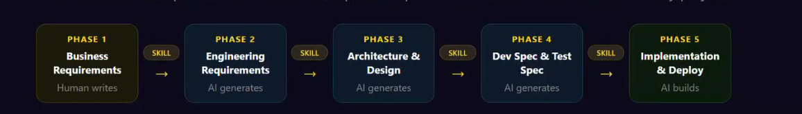

Goal: Specification driven development as shown in image
Task: create Engineering requirement for below Business Requirement. Technologies : Web app with React TS, session store as storage

Business Requirement:
1. web app should show dashboard on load which should display "Welcome to TODO list"
followed by list of tasks of any else "No tasks"
2. Should display "Create Task" button 
3. On click of Create Task button modal should open which will have Text boxes for Title of task , Description, Due Date (Calendar) & Submit button
4. On Submit added task should list in dashboard with Edit & Delete button
5. On click of Edit button Again same modal will open with the task details which user can edit
6. On click of delete button the task should get deleted from the list
